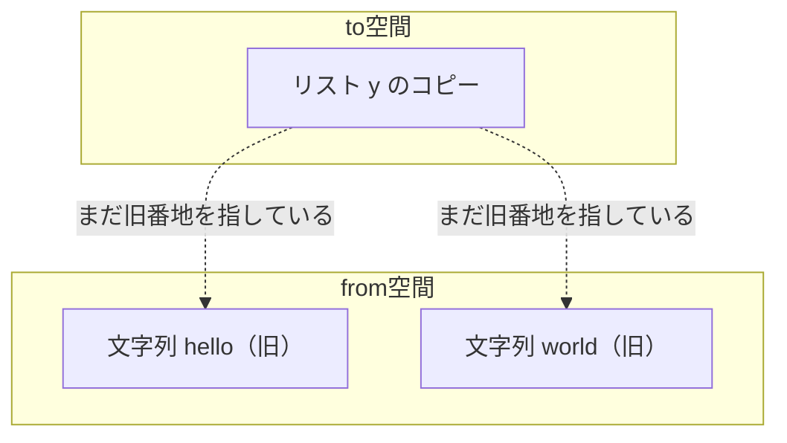
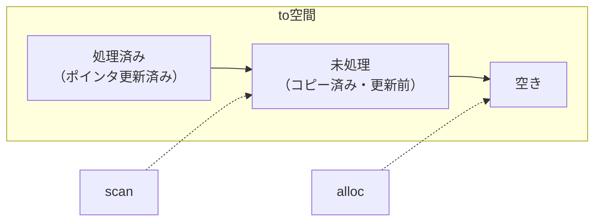
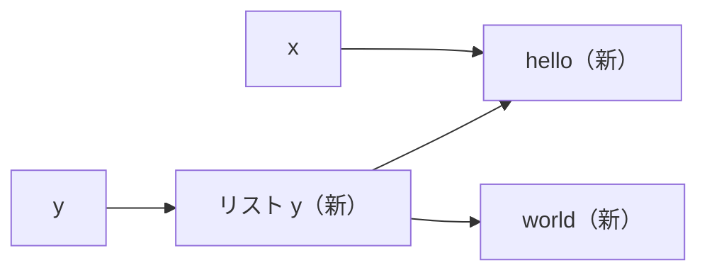

# コピー GC の仕組み

いよいよ本書の主役、コピー方式の精密 GC のアルゴリズムを組み立てます。前章で整えた下ごしらえ（自己記述的なオブジェクト、ルート、from/to の 2 空間）を使って、`collect_garbage` の中身を一歩ずつ作っていきましょう。

## 基本のアイデア：生きているものだけ引っ越す

コピー GC のやることは、一言でいえば**引っ越し**です。

1. from 空間（いま使っている側）から、**生きているオブジェクトだけ**を to 空間（空けてある側）へコピーする。
2. コピーに伴って、生きているオブジェクトを指していたポインタを、すべて**新しい番地**に書き換える。
3. from 空間にはごみしか残らないので、まるごと捨てる。from と to の役割を入れ替える（フリップ）。

ごみは「コピーしない」ことで自動的に消えます。ごみを 1 つ 1 つ探して回収するのではなく、生きているものだけを救い出し、残りは丸ごと放棄する。この発想がコピー方式の効率の源です。回収時間が「生きているデータの量」だけに比例するのはこのためです[Fenichel and Yochelson, 1969](#cite:fenichel1969)。

## 同じオブジェクトを二度コピーしない工夫：転送ポインタ

素朴に考えると、すぐ問題にぶつかります。前章の例を思い出してください。

```
x = "hello"
y = [x, x, "world"]
```

文字列 `"hello"` は、変数 `x` からと、リスト `y` の中の 2 か所からと、合わせて 3 回参照されています。これを単純にたどってコピーすると、`"hello"` が to 空間に 3 つできてしまいます。これは無駄なだけでなく、もとは「同じ 1 つのオブジェクト」だったものが 3 つに分裂し、プログラムの意味が壊れます。

そこで使うのが**転送ポインタ（forwarding pointer, フォワーディングポインタ）**です。前章でヘッダに用意した `forward` 欄がこれです。仕組みはこうです。

- あるオブジェクトを初めて to 空間へコピーしたとき、**from 空間に残っている古いほうのオブジェクト**のヘッダに、「私はもう to 空間のここへ引っ越した」という新しい番地を書き込む。これが転送ポインタ。
- 以後、同じオブジェクトに 2 回目、3 回目とたどり着いたら、転送ポインタを見て「もうコピー済みだ」と分かる。再コピーはせず、記録された新しい番地を返すだけにする。

この 1 つのオブジェクトを「コピーするか、転送ポインタを返すか」を担う関数を `copy` と呼びましょう。

```c
/* from 空間のオブジェクト obj を to 空間へ移し、新しい番地を返す。
   既にコピー済みなら、その番地を返すだけ。 */
Obj *copy(Heap *h, Obj *obj) {
    if (obj == NULL) return NULL;

    if (obj->forward != NULL) {
        return obj->forward;        /* コピー済み。新しい番地を返す */
    }

    size_t size = object_size(obj); /* 種類から大きさを求める */
    Obj *dest = (Obj *)h->to_alloc; /* to 空間の次の空き位置 */
    memcpy(dest, obj, size);        /* 中身をまるごとコピー */
    h->to_alloc += size;            /* to 空間のポインタを前へ */

    obj->forward = dest;            /* 古いほうに転送ポインタを残す */
    return dest;
}
```

> [!IMPORTANT]
> 転送ポインタは「古いオブジェクト（from 空間側）」に書き込みます。これから捨てる側に書くので、データを壊す心配はありません。そして 2 回目以降は、その印を頼りに「同じものだ」と気づける。この一手によって、共有されたオブジェクトも循環したオブジェクトも正しく 1 個だけコピーされます。

## 浅いコピーと「中身の更新」

`copy` 関数には、まだ大事な仕事が残っています。たとえばリスト `y` をコピーしたとしましょう。`memcpy` で中身をそっくり写したので、to 空間のリストが持つ要素ポインタは、**まだ from 空間の番地**を指したままです。



このままでは、新しいリストが捨てるはずの from 空間を指していて、フリップした瞬間に壊れます。だから、コピーしたオブジェクトの中の各ポインタも、それぞれの**コピー先の番地に更新**しなければなりません。前章で作った `each_field`（フィールド走査）と `copy` を組み合わせれば、これができます。

```c
/* dest（to 空間にある）の各フィールドを、コピー先の番地へ更新する */
void forward_fields(Heap *h, Obj *dest) {
    /* each_field は「ポインタの入った欄の場所」を渡してくる */
    /* 各欄について: その欄が指すオブジェクトを copy し、結果で欄を書き換える */
    /* （疑似コード的に書くと次のとおり） */
    for (each pointer slot p in dest) {
        *p = copy(h, *p);   /* 子をコピー（or 転送先取得）し、欄を更新 */
    }
}
```

ここで重要なのは、`*p = copy(h, *p)` の一行です。「いま欄が指している（古い）オブジェクト」を `copy` に渡すと、コピー先（または既存のコピー先）の番地が返ってくるので、それを欄に書き戻します。これで新しいリストは to 空間のオブジェクトを正しく指すようになります。

## Cheney のアルゴリズム：再帰を使わずに全部たどる

さて、`forward_fields` の中でまた `copy` を呼び、その先でまた `forward_fields` を呼び……と、素直に書くと**再帰**になります。深いデータ構造では再帰が深くなりすぎてスタックがあふれる危険があり、しかも GC は「メモリが足りないとき」に動くので、追加のメモリを使う再帰は特に避けたいところです。

この問題を、追加のメモリをほとんど使わずに解くのが、**Cheney のアルゴリズム**です[Cheney, 1970](#cite:cheney1970)。アイデアは驚くほど巧妙です。**to 空間そのものを「やることリスト（キュー）」として使う**のです。

to 空間に 2 つのポインタを置きます。

- **scan ポインタ**：「中のポインタをまだ更新していない」オブジェクトの先頭を指す。
- **alloc ポインタ**（前章の `to_alloc`）：「次にコピーを書き込む」位置を指す。to 空間の末尾。

`scan` と `alloc` の間にあるオブジェクトが、「コピーは済んだが、中のポインタはまだ from 空間を指している」もの、つまり「これから処理すべきもの」です。`scan` を 1 つずつ前に進め、そのオブジェクトのフィールドを更新していきます。フィールドの更新で新しいオブジェクトがコピーされると、`alloc` が後ろに伸びます。`scan` が `alloc` に追いつけば、処理すべきものが無くなった＝完了です。



この「to 空間を作業キューとして使う」工夫のおかげで、再帰も別途のスタックも要りません。生きているオブジェクトの幅優先探索（breadth-first）が、ポインタ 2 本だけで実現できるのです。

## 全体を組み立てる

部品がそろったので、`collect_garbage` の全体像を組み立てます。手順は次のとおりです。

1. to 空間の `scan` と `alloc` を、ともに to 空間の先頭にセットする。
2. **すべてのルート**について、それが指すオブジェクトを `copy` し、ルートの欄を新しい番地に書き換える（このとき最初のオブジェクト群が to 空間に積まれる）。
3. `scan` が `alloc` に追いつくまで、`scan` のオブジェクトのフィールドを `forward_fields` で更新し、`scan` を 1 つ進める。
4. 完了したら from と to を入れ替える（フリップ）。古い from 空間はごみごと放棄される。

擬似コードで書くと、こうなります。

```c
void collect_garbage(Interpreter *vm) {
    Heap *h = &vm->heap;
    h->to_alloc = h->to_start;          /* alloc を to 空間先頭へ */
    char *scan = h->to_start;           /* scan も先頭へ */

    /* 1) ルートをコピーし、ルートの欄を更新する */
    each_root(vm, /* 各ルート欄 slot に対して */ {
        *slot = copy(h, *slot);
    });

    /* 2) scan が alloc に追いつくまで、未処理オブジェクトを処理 */
    while (scan < h->to_alloc) {
        Obj *obj = (Obj *)scan;
        forward_fields(h, obj);         /* 中のポインタを更新 */
        scan += object_size(obj);       /* 次の未処理オブジェクトへ */
    }

    /* 3) from と to を入れ替える（フリップ） */
    swap(h->from_start, h->to_start);
    swap(h->from_end,   h->to_end);
    h->alloc_ptr = h->to_alloc;         /* 次の割り当て開始位置 */
}
```

> [!NOTE]
> `each_root` は前章で用意したルート集合（グローバル変数、変数環境、ハンドルスタック）をすべて巡るマクロや関数だと考えてください。ここでルートを 1 つでも漏らすと、生きているオブジェクトが回収されてしまいます。ルートの網羅性こそが、精密 GC の正しさを支える土台です。

## 手で追ってみる

抽象的な説明だけでは腑に落ちにくいので、最初の例を 1 ステップずつ追いましょう。

```
x = "hello"        （x はルート）
y = [x, x, "world"] （y はルート）
```

回収前の from 空間には、`"hello"`、リスト `y`、`"world"` の 3 つの生きたオブジェクトと、どこからも指されないごみが散らばっているとします。

**ステップ 0（初期状態）**：scan と alloc は to 空間の先頭。

**ステップ 1（ルート x の処理）**：`x` が指す `"hello"` を `copy`。to 空間に `"hello"` がコピーされ、from 空間の旧 `"hello"` に転送ポインタが残る。`x` は新番地を指すよう更新。alloc が `"hello"` の分だけ進む。

**ステップ 2（ルート y の処理）**：`y` が指すリストを `copy`。to 空間にリストがコピーされる。`y` を更新。alloc がリストの分だけ進む。この時点でリストの中身（要素ポインタ）はまだ旧番地を指している。

**ステップ 3（scan = "hello"）**：scan が指す `"hello"` のフィールドを走査。文字列はポインタを持たないので何もしない。scan を 1 つ進める。

**ステップ 4（scan = リスト y）**：scan が指すリストのフィールドを走査。
- 1 番目の要素は旧 `"hello"`。`copy` すると、転送ポインタがあるので**新しい `"hello"` の番地**が返る。欄を更新。
- 2 番目の要素も旧 `"hello"`。同じく転送ポインタにより、**同じ新番地**が返る。欄を更新。これで `"hello"` が二重コピーされず、共有が保たれる。
- 3 番目の要素は旧 `"world"`。まだコピーされていないので、ここで初めて to 空間へコピーされ、alloc が進む。欄を更新。
scan を 1 つ進める。

**ステップ 5（scan = "world"）**：`"world"` のフィールドを走査。ポインタなし。scan を進める。

**ステップ 6（scan == alloc）**：処理すべきものが尽きた。フリップして完了。to 空間には `"hello"`・リスト `y`・`"world"` が隙間なく並び、すべてのポインタが新番地を指している。ごみは旧 from 空間ごと消えた。



2 番目の `"hello"` 要素が転送ポインタのおかげで 1 つに収束しているのが、このアルゴリズムの美しいところです。循環参照（A が B を、B が A を指す）があっても、2 回目の到達時に転送ポインタで止まるので、無限ループにも二重コピーにもなりません。

## コピー方式の長所と短所（再確認）

実装してみると、第 1 章で述べた性質が具体的に実感できます。

**長所**

- **断片化しない**：生きているオブジェクトを to 空間の先頭から詰めるので、空きは常に 1 つの連続領域。割り当てはバンプアロケーションで一瞬。
- **回収が生存量に比例**：触れるのは生きているオブジェクトだけ。ごみが多いほど（生存が少ないほど）回収は速い。
- **再帰不要**：Cheney のアルゴリズムにより、追加メモリほぼゼロで全オブジェクトをたどれる[Cheney, 1970](#cite:cheney1970)。

**短所**

- **メモリを半分しか使えない**：to 空間を常に空けておくため、実効容量は確保したメモリの半分。
- **オブジェクトが動く**：すべてのポインタを正確に把握・更新する必要がある（だから精密 GC 必須）。生のポインタを GC の知らないところに隠し持つと壊れる。
- **大きなオブジェクトのコピーが重い**：巨大なオブジェクトを毎回コピーするのは無駄。これは次章の高速化テクニックで扱う。

> [!TIP]
> 「メモリを半分しか使えない」という欠点は深刻に見えますが、後で学ぶ**世代別 GC** と組み合わせると、コピー方式の長所（速い割り当て・断片化なし）を生かしつつ、半分使えない領域を「若いオブジェクト用の小さな領域」に限定できます。コピー方式は単体で完結するものではなく、より大きな設計の部品として真価を発揮します。

## まとめ

- コピー GC は「生きているものだけを to 空間へ引っ越し、from 空間を丸ごと捨てる」方式。
- **転送ポインタ**で「もうコピーした」印を残し、共有・循環があっても各オブジェクトを 1 回だけコピーする。
- コピー後はオブジェクト内の各ポインタを**新番地に更新**する必要がある。
- **Cheney のアルゴリズム**は to 空間を作業キューに使い、`scan`/`alloc` の 2 ポインタだけで再帰なしに全体をたどる[Cheney, 1970](#cite:cheney1970)。
- 長所は断片化なし・生存量比例の回収・高速割り当て。短所はメモリ半減とオブジェクト移動に伴う制約。

ここまでで、動くコピー GC のアルゴリズムが手に入りました。次章では、これを「実用的な速さ」にするためのテクニックを学びます。
