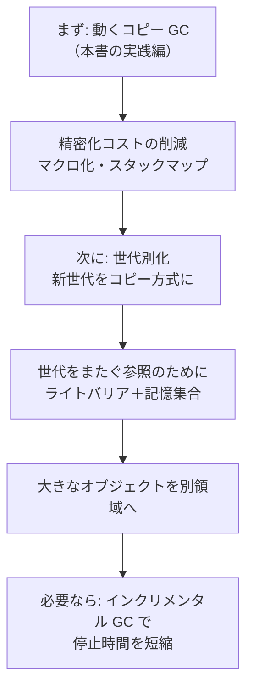

# 精密 GC を高速に実装するテクニック

前章で、動くコピー GC が手に入りました。しかし「動く」と「速い」は別物です。この章では、精密 GC を実用的な速さにするテクニックを 2 つの観点から整理します。

1. **精密化コストの削減**：「GC がポインタの場所を正確に知れる」状態を保つには実行時の手間がかかります。この手間自体をどう減らすか。
2. **GC アルゴリズムの最適化**：素朴なコピー GC に潜む無駄を、世代別 GC などで取り除く方法。

コードの完成度よりも「なぜそれが効くのか」を理解することを目指します。

---

## 精密化コストとは

前章のハンドルスタックを思い出してください。GC が起きうる操作の前後で、C のローカル変数を `push_root`/`pop_roots` で登録・解除していました。この仕組みには 2 種類のコストがあります。

**ルート登録の実行コスト**：関数呼び出しのたびに push/pop が走ります。浅い関数なら微々たるものですが、短命なオブジェクトを大量に割り当てるコードでは蓄積します。

**ポインタを必ずメモリに置くコスト**：ハンドルスタックに登録するには変数の**番地**（`&a`）を渡す必要があります。つまり対象の変数は CPU レジスタだけに置いておけず、必ずメモリ（スタックフレームかハンドルスタック）に存在しなければなりません。コンパイラが最適化でレジスタに乗せてしまうと、GC が値を更新できなくなるのです。

そして何より、**手書きによる間違えやすさ**があります。登録し忘れ・解除忘れはサイレントなメモリ破壊につながります。

## スタックマップ：コンパイラが自動化する

ハンドルスタックの課題を根本から解決するのが**スタックマップ（stack map）**または**GC マップ（GC map）**です。

コンパイラが事前に「このプログラム地点（GC セーフポイント）では、スタックのここにポインタがある」という情報をテーブルとして機械語に埋め込んでおきます。GC は実行時に push/pop を必要とせず、テーブルを参照するだけでルートの場所を特定できます。

```
（概念図）
命令列:  ...  CALL allocate  ...  CALL allocate  ...
                    ↑                  ↑
               セーフポイント A    セーフポイント B
スタックマップ:
  A: {rbp-8 → ptr, rbp-16 → ptr}
  B: {rbp-8 → ptr, rdi → ptr}
```

これにより：

- 実行時の push/pop コストがゼロ
- プログラマが手書きする必要がない（コンパイラが自動生成）
- ポインタをレジスタに置いたまま、GC セーフポイントだけを正確に記録できる

JVM、.NET CLR、LLVM の GC 基盤（`gc.statepoint` API）などはこの方式です。JIT コンパイラや AOT コンパイラを持つ処理系では今日の標準的な手法と言えます。

## インタプリタでの現実的な対処

スタックマップはコンパイラを持つ処理系向けです。純粋なインタプリタでも、ハンドルスタックのコストを減らす工夫がいくつかあります。

**マクロによる半自動化**：C のマクロやインラインヘルパーで、push/pop を関数の入口・出口に自動化します。Ruby の C 拡張 API が使う `RB_GC_GUARD` はその一例で、コンパイラがポインタを最適化で消してしまうことを防ぎます。書き忘れリスクを仕組みで減らすアプローチです。

**GC を起こす前に必要な値を揃える設計**：「GC が起きうる操作の前後で C のポインタを持ち続けない」ように API を設計するのも有効です。必要なオブジェクトを先にまとめて確保し、その後は割り当てを行わないフェーズで計算するスタイルです。push/pop の件数そのものを減らします。

**保守的スタックスキャン（partial conservatism）**：ヒープ中のオブジェクトは精密に管理しつつ、C のスタックだけはすべての値をポインタ候補として保守的にスキャンする方法があります。ルート登録の手間がゼロになりますが、スタック上の整数をポインタと誤認するリスクがあります。Boehm GC などで使われる手法で、「ヒープは精密・スタックは保守的」という折衷案です。

> [!NOTE]
> どのアプローチが最適かは「JIT コンパイラを持つか」「C 拡張とのインターフェースがあるか」「許容できる誤差範囲」によって変わります。本書ではしくみを理解するために手書きのハンドルスタック方式を採りましたが、実用処理系ではいずれかの自動化が組み合わされます。

---

## GC アルゴリズムの最適化

ここからは、精密 GC を載せた後にスループットや停止時間を改善するための、GC アルゴリズム面のテクニックを紹介します。

### 素朴なコピー GC のどこが遅いのか

まず、何が問題かをはっきりさせましょう。前章のコピー GC は、回収のたびに**生きているオブジェクトを全部コピー**します。ここに 2 つの無駄が潜んでいます。

1. **長生きするオブジェクトを何度もコピーしてしまう**。プログラムが長く使い続けるオブジェクト（グローバルな設定、長命なデータ構造）は、GC のたびに毎回 to 空間へコピーされます。動かす必要などないのに、回収のたびに引っ越しさせられるのです。
2. **回収の頻度と量のバランスが悪い**。多くのオブジェクトはすぐ捨てられる「使い捨て」ですが、それらを回収するために、たまたま長生きしているオブジェクトまで巻き込んでコピーすることになります。

これらの無駄は、ある経験則に注目すると一気に解消できます。

### 弱い世代別仮説

GC 研究の歴史で繰り返し確かめられてきた、次の経験則があります。

> **弱い世代別仮説（weak generational hypothesis）**：ほとんどのオブジェクトは若くして死ぬ。

つまり、新しく作られたオブジェクトの大半はすぐにごみになり、いったん長く生き残ったオブジェクトはその後も長く生きる傾向がある、ということです。この観察は古くから知られ、世代別 GC の出発点になりました[Lieberman and Hewitt, 1983](#cite:lieberman1983)[Ungar, 1984](#cite:ungar1984)。

この仮説が正しいなら、賢い戦略が見えてきます。「**若いオブジェクトだけを頻繁に、集中して回収すればよい**」のです。死にやすい若者の集団を小まめに掃除すれば、少ない労力で大量のごみを回収できます。一方、長生きが確定したオブジェクトは、めったに触らずそっとしておけばよい。毎回コピーする無駄が省けます。

### 世代別 GC

この戦略を実装したのが**世代別 GC（generational GC）**です。ヒープを「世代（generation）」で区切ります。最も基本的な形は 2 世代です。

- **新世代（young generation, 保育園とも呼ばれる nursery）**：新しいオブジェクトはまずここに割り当てられる。小さくて、頻繁に回収される。
- **旧世代（old generation）**：新世代を生き延びたオブジェクトが移される（**昇格／プロモーション, promotion** と呼ぶ）。大きくて、めったに回収されない。


ふだんの GC（**マイナー GC, minor GC**）は新世代だけを対象にします。新世代は小さいので一瞬で終わり、しかも仮説どおりほとんどが死んでいるので、わずかな生存者だけをコピーすればよく、非常に効率的です。新世代の回収にコピー方式を使うのは相性が抜群です。新世代を from/to の 2 空間にし、生き延びたものを旧世代へコピー（昇格）すれば、断片化なし・高速割り当てというコピー方式の長所がそのまま生きます。

旧世代がいっぱいになったときだけ、ヒープ全体を対象にした重い回収（**メジャー GC, major GC**）を行います。これは頻度が低いので、多少時間がかかっても全体への影響は小さくて済みます。

> [!TIP]
> 世代別 GC は「コピー方式に取って代わるもの」ではなく、「コピー方式を最も効果的に使う枠組み」です。前章で挙げたコピー方式の弱点（メモリ半減、長命オブジェクトの再コピー）は、コピー方式を**小さな新世代に限定する**ことでほぼ解消されます。本書で学んだコピー GC は、世代別 GC の新世代エンジンとしてそのまま使えるのです[Appel, 1989](#cite:appel1989)。

### 世代をまたぐ参照という難問

世代別 GC には、避けて通れない厄介な問題があります。マイナー GC は「新世代だけ」を見て回収します。新世代のルートはどこにあるでしょうか。グローバル変数やハンドルスタックはもちろんルートです。しかし、それだけでは足りません。

**旧世代のオブジェクトが、新世代のオブジェクトを指している**場合があるのです。


たとえば、長生きしているリスト（旧世代）に、新しく作った文字列（新世代）を追加した場合がこれにあたります。この新世代の文字列は、旧世代から参照されているので生きています。ところがマイナー GC は新世代しか見ないので、旧世代をスキャンしない限りこの参照に気づけません。かといって、毎回旧世代を全部スキャンしていたら、「新世代だけを安く回収する」という世代別 GC のうまみが消えてしまいます。

つまり、**旧世代から新世代への参照（世代をまたぐ参照）を、マイナー GC のルートに含めなければならない**。しかも、そのためにわざわざ旧世代を全走査したくない。この矛盾をどう解くかが、次の話題です。

### ライトバリアと記憶集合

解決策は、「世代をまたぐ参照が**作られた瞬間**に記録しておく」ことです。旧世代のオブジェクトに新世代へのポインタを書き込むのは、必ずプログラムの**書き込み操作（store）**を通じてです。そこで、ポインタの書き込みのたびに小さなチェックを挟み、「いま旧→新の参照ができた」場合だけ、その参照元を記録します。

この「書き込みに挟むチェック」を**ライトバリア（write barrier, 書き込み障壁）**と呼びます。そして記録された参照元（旧→新の参照を持つ旧世代オブジェクト）の集まりを**記憶集合（remembered set, リメンバードセット）**と呼びます。

```c
/* obj のフィールドに value を書き込む。旧→新ならライトバリアが働く */
void write_field(Interpreter *vm, Obj *obj, Obj **slot, Obj *value) {
    *slot = value;
    if (is_old(obj) && is_young(value)) {
        remember(vm, obj);   /* 記憶集合に obj を追加 */
    }
}
```

マイナー GC のときは、通常のルートに加えて**記憶集合に入っている旧世代オブジェクトもルート扱い**します。こうすれば、旧→新の参照を見落とさずに済み、しかも旧世代を全走査する必要もありません。書き込みのたびのわずかなコストで、回収を安く保てるわけです。

ライトバリアには「どこまで細かく記録するか」でいくつもの実装方式があり、その性能を比較した古典的な研究が知られています[Hosking et al., 1992](#cite:hosking1992)。たとえばオブジェクト単位で記録する方式、ヒープを一定サイズの区画（カード, card）に分けて「この区画に書き込みがあった」とだけ記録する**カードマーキング（card marking）**方式などがあります。カード方式は記録が単純で速い反面、マイナー GC のときに該当区画を走査し直す手間が増えます。どれが最適かはプログラムの性質によります。

> [!IMPORTANT]
> 世代別 GC を導入すると、「ポインタの書き込みは `write_field` のようなバリア付きの関数を通す」というルールが新たに加わります。前章までの「割り当てを `allocate` に集約する」「ポインタを持つ変数をハンドルスタックで守る」に続く、3 つ目の規律です。バリアを通さない直接の書き込みが 1 か所でもあると、世代をまたぐ参照を取りこぼし、生きているオブジェクトが消えます。

### 大きなオブジェクトを別扱いにする

コピー方式のもう 1 つの弱点は、大きなオブジェクトのコピーが重いことでした。巨大な配列を GC のたびに `memcpy` で丸ごと写すのは、明らかに無駄です。

これには、**大きなオブジェクトはコピーせず、専用の領域（large object space, 大オブジェクト空間）に置く**という対処があります。大きなオブジェクトは数が少ないので、コピー方式ではなく、移動を伴わない方式（マーク・アンド・スイープなど）で別管理します。生きているかどうかの判定だけ GC に任せ、本体は動かしません。こうすれば、巨大データを写し直すコストが消えます。

この「オブジェクトの性質に応じて領域と回収方式を使い分ける」という発想は、世代別 GC の延長線上にあります。若い／古い、小さい／大きい、ポインタを多く含む／含まない。そのような性質ごとに最適な扱いをするのが、実用的な GC の腕の見せどころです。

### 停止時間を縮める：インクリメンタル GC

ここまでは「全体のコスト（スループット）」を下げる話でした。もう 1 つ別の軸として、「**1 回の GC でプログラムが止まる時間（停止時間, pause time）**を短くする」という目標があります。

素朴なコピー GC は、回収のあいだプログラムを完全に止めます（**ストップ・ザ・ワールド, stop-the-world**）。新世代が小さければマイナー GC の停止は短くて済みますが、メジャー GC や、対話的な用途（ゲーム、GUI）では、一瞬の停止も気になることがあります。

そこで、GC の作業を**少しずつ小分けにして、プログラムの実行と交互に進める**手法があります。これを**インクリメンタル GC（incremental GC, 漸進的 GC）**と呼びます。コピー方式でこれを最初に実現したのが Baker のリアルタイム GC で、プログラムがオブジェクトに触れる瞬間に「まだ from 空間にいるなら今コピーする」という**リードバリア（read barrier, 読み込み障壁）**を使う巧妙な方式でした[Baker, 1978](#cite:baker1978)。

インクリメンタル GC は、合計の作業量はむしろ増えますが、1 回あたりの停止を短く保てます。停止時間とスループットはしばしばトレードオフの関係にあり、用途に応じてどちらを優先するかを選ぶことになります。

> [!NOTE]
> 本書の実践編では、まずは理解しやすいストップ・ザ・ワールドのコピー GC を完成させます。インクリメンタル GC やリアルタイム GC は、本書の範囲を超える発展的な話題です。考え方の入り口だけ示しておくので、興味が湧いたら巻末の文献にあたってみてください。

## どこから手をつけるか

テクニックがいくつも出てきたので、優先順位を整理しておきます。



最初から全部を盛り込もうとすると、どこが原因でバグが出ているのか分からなくなります。まず素朴なコピー GC を確実に動かし、性能が問題になってから 1 つずつ足していくのが定石です。実際、多くの実用処理系の GC も、この順序で少しずつ育てられてきました[Jones et al., 2023](#cite:jones2023)。

## まとめ

- 精密 GC の「正確さ」にはコストがある。**ルート登録（push/pop）の実行コスト**と**ポインタをメモリに置くコスト**が主な内訳。
- コンパイラを持つ処理系では**スタックマップ**でこのコストを排除できる。インタプリタではマクロによる半自動化や保守的スタックスキャンが現実的な選択肢。
- アルゴリズム面では、**弱い世代別仮説**（多くのオブジェクトは若くして死ぬ）に基づく**世代別 GC**が有効。新世代の回収にコピー方式が最適。
- 世代をまたぐ参照（旧→新）を取りこぼさないために、**ライトバリア**で参照の発生を記録し、**記憶集合**としてマイナー GC のルートに加える。
- 大きなオブジェクトは**専用領域**に置き、コピーを避ける。
- 停止時間が問題なら**インクリメンタル GC** で作業を小分けにする（スループットとのトレードオフ）。
- まず動くものを作り、必要に応じて 1 つずつ高速化を足すのが王道。

次章では、これまでの内容を統合し、小さなインタプリタに実際に動くコピー GC を組み込みます。
