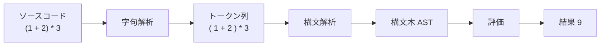
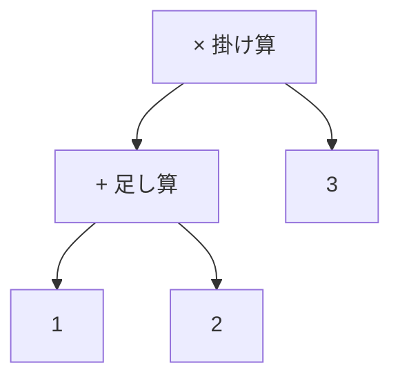
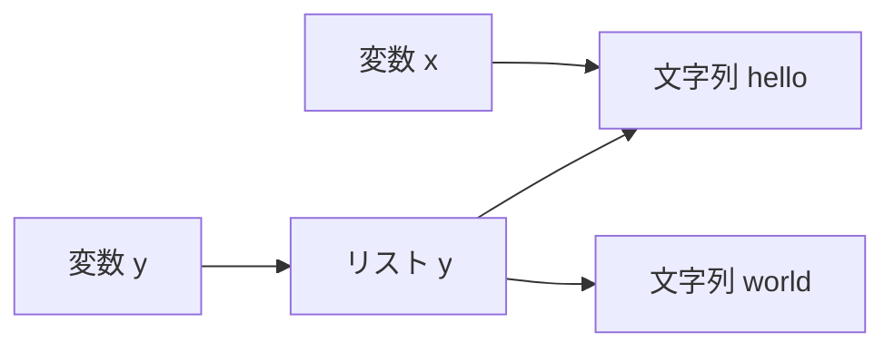

# インタプリタの基礎知識

GC を載せる前に、載せる相手であるインタプリタの仕組みを理解しておきましょう。この章では、インタプリタがソースコードをどう処理し、その過程でどんなデータをヒープに作るのかを整理します。GC が管理する「オブジェクト」がどこから生まれるのかを押さえるのが目標です。

## インタプリタとは何か

**インタプリタ（interpreter）**とは、プログラムのソースコードを読み込み、その意味を解釈しながら実行するプログラムです。同じ「言語処理系」でも、ソースコードを機械語・バイトコード・JavaScriptなど別の形式のコードに翻訳してファイルとして出力する**コンパイラ（compiler）**とは役割が違います。コンパイラが「翻訳して終わり」なのに対し、インタプリタは「翻訳しながら（あるいは翻訳せずに）その場で実行する」のが特徴です[Nystrom, 2021](#cite:nystrom2021)。

たとえば次のような小さな言語の式を考えます。

```
(1 + 2) * 3
```

インタプリタはこれを受け取って `9` という結果を返します。この間に内部で何が起きているのかを、次の節で順に追いましょう。なお、「プログラムを解釈するプログラム」という考え方そのものは、古典的な教科書 SICP でも中心的な題材として扱われています[Abelson et al., 1996](#cite:abelson1996)。

## ソースコードから実行まで

多くのインタプリタは、ソースコードを次の 3 段階で処理します。



### 字句解析

最初の段階は**字句解析（lexical analysis）**です。ソースコードはただの文字の並びなので、まず意味のある最小単位に切り分けます。この単位を**トークン（token）**と呼びます。`(1 + 2) * 3` なら、`(`、`1`、`+`、`2`、`)`、`*`、`3` という 7 個のトークンに分かれます。空白や改行はここで取り除かれます。

### 構文解析

次が**構文解析（parsing, パース）**です。トークンの並びを、言語の文法に従って木構造に組み立てます。この木を**構文木**、より正確には**抽象構文木（abstract syntax tree, AST）**と呼びます。AST は、式の構造——どの計算が先で、どれが後か——を表現します。

`(1 + 2) * 3` の AST は次のようになります。



掛け算が一番上にあり、その左の子が「1 + 2」、右の子が「3」です。この形になっていれば、「先に 1 + 2 を計算し、その結果に 3 を掛ける」という順序が木の構造として表現できています。

### 評価

最後が**評価（evaluation）**です。AST を上からたどり、各ノードの意味を計算していきます。掛け算ノードを評価するには、まず左右の子を評価して値を求め、それらを掛け合わせます。左の子（足し算ノード）を評価すると `3`、右の子は `3` なので、掛け算の結果は `9` です。

このように、AST のノードをたどって直接計算するインタプリタを**木構造インタプリタ（tree-walking interpreter）**と呼びます。仕組みが分かりやすく、最初に作るインタプリタとして最適です[Nystrom, 2021](#cite:nystrom2021)。本書もこの方式を前提にします。

> [!NOTE]
> もっと高速なインタプリタでは、AST を**バイトコード（bytecode）**という中間的な命令列に変換し、それを仮想機械（VM）が実行します。バイトコード方式でも GC の本質は変わりません。本書では理解しやすさを優先して木構造インタプリタを採用しますが、ここで学ぶ GC の考え方はバイトコード VM にもそのまま応用できます。

## 値とオブジェクト

GC の話に近づくために、評価の途中で生まれる「値」に注目しましょう。

インタプリタが扱う値は、大きく **即値（immediate value）** と **オブジェクト（object）** の 2 種類に分かれます。

**即値**は、変数のスロット（ポインタサイズの一枠）に値そのものを直接収められるものです。`1` や `2` のような整数、`true`/`false` のような真偽値、`nil` などがこれにあたります。即値はヒープを使いません。

**オブジェクト**は、ヒープに確保した領域を**ポインタ**経由で参照するものです。文字列・リスト・クロージャ・クラスのインスタンスなどがこれにあたります。

重要なのは、**サイズが固定されていてもオブジェクトになりえる**という点です。たとえば、フィールドが 3 つの固定サイズのクラスインスタンスであっても、それはヒープに置かれます。なぜなら、「複数の変数が同じインスタンスを共有できる」「`a` と `b` が同一のインスタンスかどうかを区別できる（**同一性**）」といった言語の要件を満たすには、ヒープ上の独立した領域に置いてポインタで参照する必要があるからです。

本書では、ヒープに割り当てられて GC の管理対象になるデータを**オブジェクト（object）**と呼びます。即値はヒープを使わないので、GC の管理外です。

> [!IMPORTANT]
> 「GC が管理するのはヒープ上のオブジェクトだけ」という点をしっかり押さえてください。数値や真偽値のような小さな即値はヒープを使わないので、GC は関与しません。GC が見るのは、ポインタでつながったオブジェクトのネットワークだけです。

たとえば、次のような小さな言語のプログラムを考えます。

```
x = "hello"
y = [x, x, "world"]
```

ここで `"hello"` と `"world"` は文字列オブジェクト、`[...]` はリストオブジェクトとしてヒープに割り当てられます。変数 `x` と `y` は、それらのオブジェクトを指すポインタを持ちます。リスト `y` の中身もまた、文字列オブジェクトへのポインタです。



注目すべきは、`"hello"` オブジェクトが変数 `x` とリスト `y` の両方から指されていることです。このように 1 つのオブジェクトが複数の場所から共有されるからこそ、「いつ解放してよいか」を人間が判断するのは難しく、GC が必要になるのでした（前章を思い出してください）。

## オブジェクトの中身

GC を実装する立場では、オブジェクトがメモリ上でどんな形をしているかが決定的に重要です。なぜなら、GC は「このオブジェクトのどこにポインタが入っているか」を知らないと、到達可能性をたどれないからです。

典型的なオブジェクトは、**ヘッダ（header）**と**本体（body）**からできています。

- **ヘッダ**：そのオブジェクトの種類（文字列なのかリストなのか）や大きさなど、GC や処理系が必要とする管理情報を入れる部分。
- **本体**：実際のデータ。文字列なら文字の並び、リストなら要素へのポインタの並び。

C 言語で簡単に書くと、種類を表すタグを持ったヘッダはこんなイメージです。

```c
typedef enum { OBJ_STRING, OBJ_LIST } ObjType;

typedef struct Obj {
    ObjType type;      /* オブジェクトの種類（ヘッダ） */
    /* 種類ごとの本体が続く */
} Obj;
```

種類（`type`）が分かれば、「文字列ならポインタは入っていない」「リストなら本体は全部ポインタだ」というように、ポインタの位置を割り出せます。この「種類からポインタの位置を知る」仕組みが、精密 GC の心臓部です。詳しくは次章で設計します。

## インタプリタがオブジェクトを作るタイミング

GC は「メモリが足りなくなったとき」に起動するのが基本です。では、メモリが減るのはいつかというと、インタプリタが新しいオブジェクトを割り当てるときです。具体的には、次のような場面でオブジェクトが生まれます。

- 文字列リテラル（`"hello"`）を評価したとき
- リストや配列を作ったとき（`[1, 2, 3]`）
- 2 つの文字列を連結するなど、計算結果として新しいオブジェクトができたとき
- 関数（クロージャ）を作ったとき

これらはすべて「割り当て関数」を呼び出します。本書では、この割り当ての入口を 1 か所にまとめます。そうしておけば、「割り当てようとしてメモリが足りなければ GC を起動する」という処理を、その 1 か所に書くだけで済むからです。

```c
Obj *allocate(Interpreter *vm, ObjType type, size_t size) {
    if (/* 空きが足りない */) {
        collect_garbage(vm);   /* GC を起動してごみを回収 */
    }
    /* ヒープから size バイト確保して返す */
}
```

この `allocate` こそ、インタプリタと GC が出会う接点です。本書のこれ以降の章は、この関数の中身——とくに `collect_garbage` の中身——をどう作るかという話だと言ってもよいでしょう。

## まとめ

- インタプリタはソースコードを**字句解析・構文解析・評価**の 3 段階で処理する。
- 本書では分かりやすい**木構造インタプリタ**を扱う。
- 値は**即値**（スロットに直接収まる整数・真偽値など）と**オブジェクト**（ヒープ割り当て）に分かれる。サイズが固定でもオブジェクトになりえる。GC が管理するのはオブジェクトのみ。
- オブジェクトは**ヘッダ（種類などの管理情報）**と**本体（実データ）**からなり、種類が分かればポインタの位置を割り出せる。
- オブジェクトはおもに割り当て関数 `allocate` を通じて作られ、ここが GC を起動する自然な場所になる。

次章では、このインタプリタを精密 GC に対応させるために、オブジェクトの形やルートの管理をどう設計すればよいかを具体的に詰めていきます。
