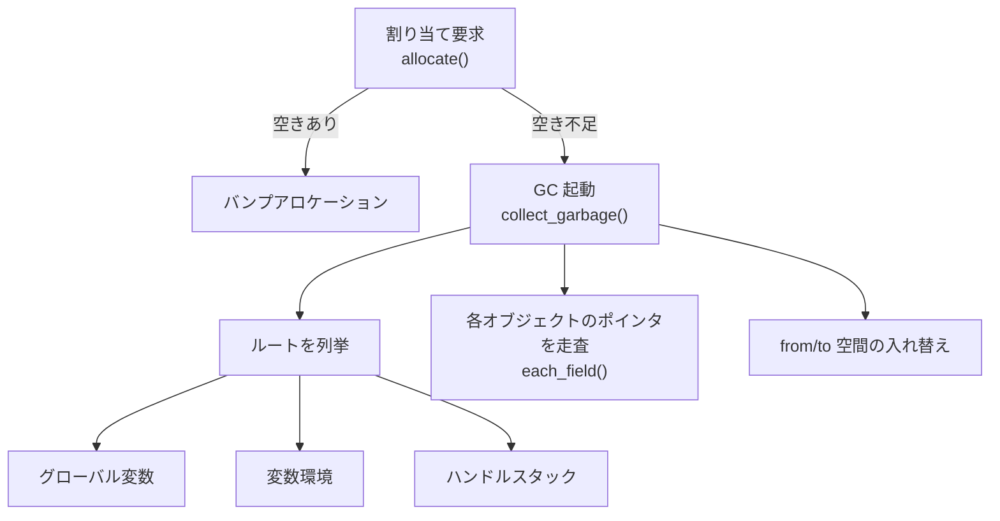

# インタプリタを精密 GC 対応にする

前章までで、GC の考え方と、それを載せるインタプリタの姿が見えてきました。この章では、コピー方式の精密 GC を載せるために、インタプリタ側に何を用意しておく必要があるかを設計します。アルゴリズムそのものは次章ですが、その前に「下ごしらえ」が要るのです。

コピー方式の精密 GC が成り立つには、最低限つぎの 3 つが必要です。

1. オブジェクトを見て**ポインタの位置が正確に分かる**こと（オブジェクトの設計）
2. **ルート**をすべて漏れなく列挙できること（ルートの管理）
3. 生きているオブジェクトのコピー先となる**ヒープの構造**が用意されていること

順に見ていきましょう。

## オブジェクトを「自己記述的」にする

精密 GC の出発点は、「どのオブジェクトのどこにポインタが入っているかを、GC が正確に知れる」ことでした。これを実現する最も素直な方法は、各オブジェクトに**自分の種類を表すタグ**を持たせ、種類ごとに「どこがポインタか」を決めておくことです。種類さえ分かればポインタの位置が割り出せるので、オブジェクトは**自己記述的（self-describing）**になります。

前章のヘッダを、GC 用の情報を加えて拡張します。

```c
typedef enum { OBJ_STRING, OBJ_LIST } ObjType;

typedef struct Obj {
    ObjType type;          /* 種類タグ */
    struct Obj *forward;   /* GC 用（後述）。コピー先を記録するための欄 */
} Obj;
```

`forward` という欄を足しました。これはコピー方式の GC が「このオブジェクトはもう to 空間に引っ越した」という情報を書き込むための場所です。役割は次章で詳しく説明しますが、ヘッダに最初から場所を確保しておく必要があるので、ここで入れておきます。

種類ごとの具体的なオブジェクトは、このヘッダを先頭に置いた構造体として定義します。C では、共通のヘッダを先頭に置くと、`Obj *` 経由でどの種類のオブジェクトも一様に扱えます。

```c
typedef struct {
    Obj obj;               /* 先頭は必ずヘッダ */
    int length;
    char *chars;           /* 文字の並び（ポインタを含まない本体） */
} ObjString;

typedef struct {
    Obj obj;               /* 先頭は必ずヘッダ */
    int count;
    Obj **items;           /* 各要素はオブジェクトへのポインタ */
} ObjList;
```

ここが精密 GC の肝心なところです。`ObjString` の本体（`chars`）は文字の並びであって、**他のオブジェクトを指すポインタは含みません**。一方 `ObjList` の本体（`items`）は、**すべてがオブジェクトへのポインタ**です。つまり：

- `OBJ_STRING` を見たら、本体にポインタは無いと分かる。
- `OBJ_LIST` を見たら、本体の `count` 個がすべてポインタだと分かる。

この対応関係を GC が知っていれば、任意のオブジェクトについて「中のポインタを列挙する」操作が書けます。これを**フィールド走査**と呼ぶことにします。

```c
/* obj が直接指している子オブジェクトに対して visit を呼ぶ */
void each_field(Obj *obj, void (*visit)(Obj **slot)) {
    switch (obj->type) {
    case OBJ_STRING:
        /* 文字列はポインタを持たない。何もしない */
        break;
    case OBJ_LIST: {
        ObjList *list = (ObjList *)obj;
        for (int i = 0; i < list->count; i++) {
            visit(&list->items[i]);   /* 各要素はポインタ */
        }
        break;
    }
    }
}
```

> [!IMPORTANT]
> `visit` に渡しているのが `&list->items[i]`、つまりポインタが入っている**欄そのものの場所**（ポインタへのポインタ）である点に注目してください。コピー方式の GC はオブジェクトを動かすので、その欄に入っている値を**書き換える**必要があります。書き換えるには「どの欄か」を指す必要があるので、値そのものではなく欄の場所を渡すのです。この区別は次章で効いてきます。

この `each_field` の中の `switch` 文に、新しいオブジェクト種類を 1 つ追加し忘れると、GC はそのオブジェクトの中のポインタを見落とし、まだ生きているデータをごみと誤判定してしまいます。精密 GC を保守するうえで、ここは最も注意すべき場所です。

> [!WARNING]
> オブジェクト種類を増やしたら、必ず `each_field`（フィールド走査）にもその種類の処理を追加してください。追加を忘れると、そのオブジェクトから先に到達できるデータが回収されてしまい、原因の分かりにくいバグになります。「種類を 1 つ足したら、走査も 1 つ足す」をルールにしましょう。

## ルートをどう把握するか

GC は**ルート**（プログラムがいま直接触れる変数の集まり）から到達可能性をたどるのでした。コピー方式では、ルートから出発して生きているオブジェクトをコピーし、ついでにルート自身が持つポインタも新しい番地に書き換えます。

したがって、**ルートを 1 つ残らず GC に教えられること**が必須です。1 つでも漏らすと、そこから到達できるオブジェクトが回収されてしまい、プログラムが壊れます。逆に、生きていないものをルートに含めると、ごみが回収されずメモリを浪費します。

インタプリタにおけるルートには、たとえば次のものがあります。

- **グローバル変数**：プログラム全体で生きている変数。
- **実行中の変数環境**：いま評価中の関数のローカル変数を保持する表（環境、environment）。
- **評価の途中で C のローカル変数として一時的に保持しているオブジェクト**：これが曲者です。

最初の 2 つは、インタプリタが明示的なデータ構造で持っているので比較的簡単に列挙できます。問題は 3 つ目です。

### 一時オブジェクトという落とし穴

たとえば「2 つの文字列を連結する」処理を考えます。

```c
ObjString *concat(Interpreter *vm, ObjString *a, ObjString *b) {
    int len = a->length + b->length;
    ObjString *result = new_string(vm, len);   /* ここで GC が起きるかも！ */
    /* a と b の中身を result にコピー */
    return result;
}
```

`new_string` はオブジェクトを割り当てます。前章で見たように、割り当て時にメモリが足りなければ GC が起動します。すると、その GC は `a` と `b` をルートとして認識できているでしょうか？

`a` と `b` は C のローカル変数（関数の引数）です。インタプリタの環境やグローバル変数の表には入っていません。もし GC がこれらを知らなければ、`new_string` の最中に `a` や `b` がコピーされず、最悪の場合ごみとして回収されてしまいます。さらにコピー方式では、たとえ回収されなくても `a` や `b` が**別の番地に動かされる**ため、`concat` が持っている古い `a`・`b` のポインタは無効になり、連結後の中身がでたらめになります。

これが精密コピー GC で最も間違えやすい点、**ルートの取りこぼし**です。

> [!CAUTION]
> 「GC を起こしうる割り当ての前後で、C のローカル変数として握っているオブジェクトは、すべてルートとして登録しておく」。これを徹底しないと、コピー GC は静かにデータを壊します。エラーも出ずに結果だけが間違うので、発見が非常に困難です。

### ハンドルスタック（シャドースタック）

この問題への定番の解決策が、**ハンドルスタック**（**シャドースタック**とも呼びます）です。考え方はシンプルで、「C のローカル変数として握っているオブジェクトを、GC からも見える専用のスタックに登録しておく」というものです。

```c
#define MAX_ROOTS 256

typedef struct {
    Obj **slots[MAX_ROOTS];   /* 登録されたルート（欄の場所）の配列 */
    int count;
} RootStack;

/* ローカル変数 slot をルートとして登録 */
void push_root(RootStack *rs, Obj **slot) {
    rs->slots[rs->count++] = slot;
}

/* 登録を解除（関数を抜けるとき） */
void pop_roots(RootStack *rs, int n) {
    rs->count -= n;
}
```

先ほどの `concat` は、`a` と `b` を登録してから割り当てを行うように直します。

```c
ObjString *concat(Interpreter *vm, ObjString *a, ObjString *b) {
    push_root(&vm->roots, (Obj **)&a);   /* a を保護 */
    push_root(&vm->roots, (Obj **)&b);   /* b を保護 */

    int len = a->length + b->length;
    ObjString *result = new_string(vm, len);   /* GC が起きても a,b は安全 */
    /* a と b の中身を result にコピー（a,b は最新の番地に更新済み） */

    pop_roots(&vm->roots, 2);             /* 保護を解除 */
    return result;
}
```

`&a` のように**ローカル変数の場所**を登録しているのがポイントです。GC は `a` の現在地を新しい番地にコピーするとき、この欄の値も書き換えてくれます。だから `new_string` のあとで `a` を使っても、ちゃんと新しい番地を指しているのです。フィールド走査のときに「値ではなく欄の場所」を渡したのと、まったく同じ理由です。

> [!NOTE]
> ハンドルスタックは手作業で書く必要があり、登録・解除を間違えやすい部分です。実際の言語処理系では、これをマクロや専用 API で半自動化したり、そもそもポインタを移動させないなどの工夫で負担を減らしたりします。本書ではしくみを理解するために、あえて手で書く方式を採ります。

## ヒープを 2 つの空間に分ける

最後の下ごしらえは、コピー方式のためのヒープ構造です。前章で触れたとおり、コピー方式はヒープを同じ大きさの **from 空間**と **to 空間**の 2 つに分けます。ふだんは from 空間だけを使い、to 空間は空けておきます。

実装は意外と単純です。大きなメモリ塊を 2 つ用意し、from 空間には「次に割り当てる位置」を指すポインタ（**アロケーションポインタ**）を持たせます。

```c
typedef struct {
    char *from_start;   /* from 空間の先頭 */
    char *from_end;     /* from 空間の末尾 */
    char *alloc_ptr;    /* 次に割り当てる位置 */

    char *to_start;     /* to 空間の先頭 */
    char *to_end;       /* to 空間の末尾 */

    size_t space_size;  /* 各空間の大きさ */
} Heap;
```

割り当ては「アロケーションポインタを必要なバイト数だけ前に進めるだけ」で済みます。これを**バンプアロケーション（bump allocation, ポインタを“こつん”と押し出す割り当て）**と呼びます。空きが連続している（断片化していない）からこそ可能な、非常に高速な割り当てです。

```c
Obj *allocate(Interpreter *vm, ObjType type, size_t size) {
    Heap *h = &vm->heap;
    if (h->alloc_ptr + size > h->from_end) {
        collect_garbage(vm);              /* 空きが足りなければ GC */
        if (h->alloc_ptr + size > h->from_end) {
            fatal("ヒープ不足: これ以上割り当てられません");
        }
    }
    Obj *obj = (Obj *)h->alloc_ptr;
    h->alloc_ptr += size;                 /* ポインタを前へ */
    obj->type = type;
    obj->forward = NULL;
    return obj;
}
```

GC（`collect_garbage`）が呼ばれると、from 空間の生きているオブジェクトを to 空間へコピーし、最後に from と to を入れ替え（フリップし）ます。入れ替え後、アロケーションポインタは「コピーで使った分の直後」を指し、そこから再びバンプアロケーションが始まります。この `collect_garbage` の中身が、次章の主題です。

> [!TIP]
> バンプアロケーションの速さは、コピー方式の隠れた魅力です。マーク・アンド・スイープのように空き領域のリストを管理する必要がなく、割り当ては足し算 1 回で終わります。「割り当てが速いこと」は、オブジェクトを頻繁に作る言語処理系にとって大きな利点です[Appel, 1989](#cite:appel1989)。

## 下ごしらえの全体像

ここまでに用意したものを図にまとめます。



- オブジェクトは**種類タグ**を持ち、`each_field` でポインタを正確に列挙できる（自己記述的）。
- **グローバル変数・変数環境・ハンドルスタック**を合わせたものが、漏れのないルート集合になる。
- ヒープは **from/to の 2 空間**に分かれ、割り当ては**バンプアロケーション**で行う。

これで、コピー GC を動かすための舞台が整いました。次章では、いよいよ `collect_garbage` の中身（生きているオブジェクトを to 空間へコピーしていくアルゴリズム）を組み立てます。

## まとめ

- 精密コピー GC には、(1) ポインタ位置が正確に分かるオブジェクト設計、(2) 漏れのないルート列挙、(3) from/to の 2 空間ヒープ、の 3 つの下ごしらえが要る。
- オブジェクトに**種類タグ**を持たせ、種類ごとにポインタ位置を決めることで**自己記述的**にする。ポインタの列挙は `each_field` に集約する。
- C のローカル変数として一時的に握るオブジェクトは**ルートの取りこぼし**の温床。**ハンドルスタック（シャドースタック）**で GC から見えるようにして守る。
- ヒープを 2 空間に分け、割り当ては**バンプアロケーション**で高速に行う。空き不足のとき GC を起動する。

次章で、その GC 本体のアルゴリズムに踏み込みます。
