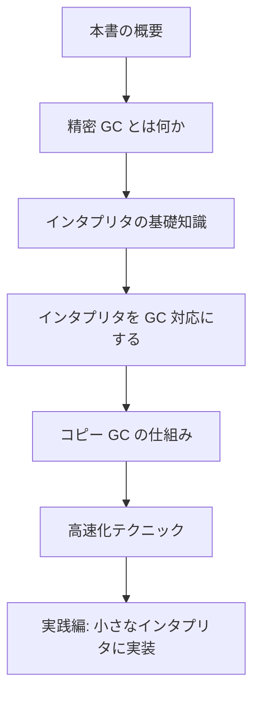

# 本書の概要

この章では、本書が何を目指しているのか、どんな順番で何を学ぶのか、そして読み進めるために知っておいてほしい前提を説明します。地図を最初に眺めておくと、あとの章で「いま自分はどこにいるのか」が分かりやすくなります。

## この本で作れるようになること

本書を読み終えると、次のことができるようになります。

- 自分で書いた小さなインタプリタに、**コピー方式の精密 GC** を組み込む
- なぜそのコードが必要なのかを、アルゴリズムのレベルで説明できる
- GC を「速くする」ための代表的なテクニックの考え方を理解する

ゴールは「動く GC を 1 つ自分の手で完成させること」です。完璧で本番品質の GC を作ることではありません。まずは小さくても確実に動くものを作り、その上で改良の方向を知る、という順序で進めます。

GC（ガベージコレクション、garbage collection）とは、プログラムが使わなくなったメモリを自動的に見つけて再利用する仕組みのことです。多くの現代的な言語（Java、Python、Ruby、JavaScript、Go など）はこの仕組みを内蔵しているので、プログラマが「もうこのデータは要らない」といちいち書かなくても、メモリが枯渇しません。本書は、その仕組みを「使う側」ではなく「作る側」から眺めます。

## なぜインタプリタと GC を一緒に学ぶのか

GC は、それ単体ではあまり意味がありません。GC は「誰かが作ったたくさんのデータ（オブジェクト）」を管理する仕事だからです。そのデータを生み出すのが、プログラミング言語の処理系（本書ではインタプリタ）です。

インタプリタとは、プログラムのソースコードを読み込み、その意味を解釈しながら実行するプログラムのことです。たとえば電卓に `1 + 2 * 3` と打ち込むと `7` が返ってくる、あの「式を理解して計算する部分」を一般化したものだと考えてください。

インタプリタが動くと、文字列・リスト・関数といったさまざまな値がメモリ上に作られます。これらの値の寿命を管理するのが GC の役目です。つまりインタプリタは GC にとって「現場」であり、GC を学ぶには現場を持っているのがいちばんの近道なのです。本書がインタプリタと GC をセットで扱うのはこのためです。

## 「精密」とはどういう意味か

GC には大きく分けて 2 つの流派があります。**精密 GC（precise GC）**と**保守的 GC（conservative GC）**です。詳しくは次章で説明しますが、ここでは雰囲気だけつかんでおきましょう。

- **精密 GC** は、メモリ上のどの場所が「他のデータを指すポインタ」なのかを正確に把握しています。だから、不要なデータを安全に動かしたり捨てたりできます。
- **保守的 GC** は、ポインタかどうか確信が持てないまま、「ポインタかもしれない」ものを手がかりに動きます。手軽ですが、できることに制限があります。

本書がねらうコピー方式の GC は、生きているデータをメモリの別の場所へ「引っ越し」させます。引っ越しのときにはポインタの値を書き換える必要があるので、「どこがポインタか」を正確に知っていなければなりません。したがってコピー方式は精密 GC でなければ実現できません。本書のタイトルが「精密 GC」である理由はここにあります。

## 本書の進み方

本書は次の順序で進みます。各章は前の章を前提にしているので、できれば順番に読んでください。

1. **精密 GC とは何か**：メモリ管理の基礎、GC の代表的な方式、「精密」と「保守的」の違いを学びます。
2. **インタプリタの基礎知識**：本書で扱うインタプリタがどんな構造で、どんなデータ（オブジェクト）を作るのかを整理します。
3. **インタプリタを GC 対応にする**：GC を載せるために、インタプリタ側に何を準備すればよいか（オブジェクトの形、ルートの管理など）を説明します。
4. **コピー GC の仕組み**：本書の主役であるコピー方式のアルゴリズムを、図とコードで詳しく追います。
5. **高速化テクニック**：世代別 GC やライトバリアなど、GC を実用的な速さにするための考え方を紹介します。
6. **実践編**：小さなインタプリタを 1 つ題材に、これまでの内容を統合して動く精密 GC を完成させます。

巻末には、本文で使った用語をまとめた**用語集**があります。途中で分からない言葉が出てきたら参照してください。

## 必要な前提知識

身構える必要はありませんが、次のことを知っているとスムーズです。

- 変数・関数・配列・`if`・ループといった基本的なプログラミングの概念
- 「メモリ」という言葉が、データを置いておく場所を指すこと

C 言語の細かい文法やポインタの知識は前提にしません。ポインタについては必要になったところで説明します。数式や図を使うこともありますが、難しい数学は使いません。

> [!TIP]
> 1 回で全部を理解しようとしないでください。GC は「全体像」と「細部」を行き来しながら何度も読み返すうちに腑に落ちる種類の話題です。まずはざっと通読し、実践編で手を動かしてからもう一度戻ってくる、という読み方をおすすめします。

## さらに深く学びたい人へ

本書はあくまで「最初の一歩」を踏み出すための入門書です。GC は半世紀以上の歴史を持つ奥深い分野で、本書で触れられるのはそのごく一部です。もっと体系的に学びたくなったら、GC の理論と実装を網羅的にまとめた『The Garbage Collection Handbook』 が定番の参考書になります。インタプリタ作りそのものをもっと知りたい場合は『Crafting Interpreters』 が読みやすくおすすめです。

それでは、次章でまず「GC とは何か」から始めましょう。
