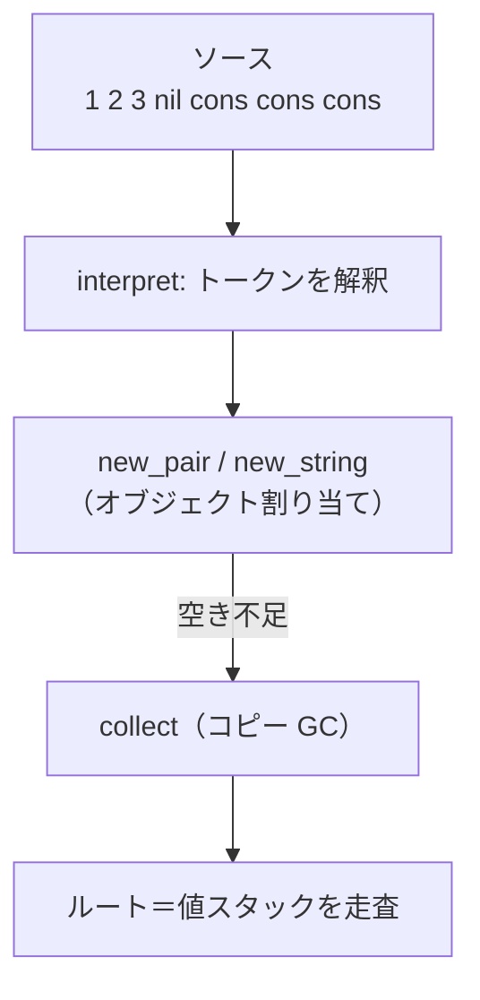

# 実践編：小さなインタプリタに実装する

最終章では、これまで学んだことを 1 つにまとめます。**minilang** という名前の、ごく小さなインタプリタを題材に、動くコピー方式の精密 GC を最初から最後まで作りきります。コードは 200 行ほどで、すべて C 言語です。順番に組み立てながら、「なぜこの行が必要か」を一つひとつ確かめていきましょう。

この章のコードは実際にコンパイル・実行して動作を確認したものです。完成版を動かすと、最後に GC が何十回起きても、生きているデータがきちんと残ることが確認できます。

## 題材：何を作るか

題材の minilang は、空白で区切られたトークンを左から順に解釈して実行する、スタック型の小さな言語です。本格的な文法はありませんが、「ソースコードを読んで解釈・実行する」という点でれっきとしたインタプリタです。扱える操作は次の 5 つだけにします。

- 整数（`1`, `42` など）：値スタックに整数を積む
- `nil`：空リストを積む
- `cons`：スタック上位 2 つを取り出し、ペア（リストの 1 要素）にして積む
- `str:文字列`：文字列オブジェクトを作って積む
- `drop`：スタック先頭を捨てる

たとえば `1 2 3 nil cons cons cons` というプログラムを実行すると、リスト `(1 2 3)` がスタックに残ります。`cons` と `str:` がオブジェクト（ペアと文字列）をヒープに割り当てるので、ここに GC が必要になります。スタックにデータを積みながらトークンを左から逐次処理するこの実行スタイルは、Forth のような連接型（concatenative）言語に近く、リストや文字列を扱う設計は GC 発祥の地である LISP のミニチュア版でもあります[McCarthy, 1960](#cite:mccarthy1960)。

minilang が動くときのデータの流れは、第 3 章で見た図そのものです。



## 値とオブジェクトの表現

まず、minilang が扱う「値」を定義します。第 2 章で学んだとおり、数値のような即値はヒープを使わず、文字列やペアのような大きなデータだけをオブジェクトとしてヒープに置きます。これを 1 つの型で表すために、**タグ付きの値（tagged value）**を使います。

```c
typedef enum { OBJ_PAIR, OBJ_STRING } ObjType;

typedef struct Obj {
    ObjType type;          /* 種類タグ */
    struct Obj *forward;   /* GC 用の転送ポインタ */
} Obj;

typedef enum { VAL_INT, VAL_NIL, VAL_OBJ } ValueType;
typedef struct {
    ValueType type;
    union { long i; Obj *obj; } as;
} Value;
```

`Value` は「整数 (`VAL_INT`)」「空リスト (`VAL_NIL`)」「オブジェクト参照 (`VAL_OBJ`)」のいずれかです。`VAL_OBJ` のときだけ `as.obj` がヒープ上のオブジェクトを指します。この区別こそが「精密」の出発点です。GC は `Value` のタグを見るだけで、それがポインタなのか（`VAL_OBJ`）、ただの整数なのか（`VAL_INT`）を**正確に**判断できます。保守的 GC のように推測する必要はありません。

オブジェクトの実体は 2 種類です。第 3 章で設計したとおり、先頭に共通ヘッダ `Obj` を置き、種類ごとに本体を続けます。

```c
typedef struct {
    Obj obj;               /* 先頭は必ずヘッダ */
    Value car;
    Value cdr;
} ObjPair;                 /* リストの 1 要素（先頭 car と残り cdr） */

typedef struct {
    Obj obj;               /* 先頭は必ずヘッダ */
    int length;
    char chars[];          /* 文字列本体（可変長メンバ） */
} ObjString;
```

ペア（`ObjPair`）は 2 つの `Value`（`car` と `cdr`）を持ちます。これらは別のオブジェクトを指しうるので、GC が走査すべきポインタです。一方、文字列（`ObjString`）の本体 `chars` はただの文字の並びで、ポインタを含みません。`chars[]` という末尾の可変長メンバに文字列を直接埋め込むことで、文字列オブジェクトを 1 回の割り当てで完結させ、外部に別のメモリ塊を持たせない設計にしています。こうしておくと、コピーのときに `memcpy` 一発で済み、扱いが単純になります。

ヘッダの `forward` 欄は、第 4 章・第 5 章で見た転送ポインタの置き場所です。ふだんは `NULL`、GC でコピーされたときだけコピー先の番地が入ります。

## ヒープと割り当て

次に、from/to の 2 空間からなるヒープと、バンプアロケーションによる割り当てを用意します。

```c
typedef struct {
    char *from, *to;       /* 2 つの空間の先頭 */
    char *alloc;           /* 次の割り当て位置 */
    char *from_end;        /* from 空間の末尾 */
    size_t size;           /* 各空間の大きさ */
} Heap;
```

割り当ての本体 `allocate` は、第 3 章で組んだものとほぼ同じです。空きが足りなければ `collect`（GC）を呼び、それでも足りなければ本当のメモリ不足としてあきらめます。

```c
static size_t align8(size_t n) { return (n + 7) & ~(size_t)7; }

static Obj *allocate(VM *vm, ObjType type, size_t size) {
    Heap *h = &vm->heap;
    size = align8(size);                    /* 8 バイト境界にそろえる */
    if (h->alloc + size > h->from_end) {
        collect(vm);                        /* 空き不足なら GC */
        if (h->alloc + size > h->from_end) {
            fprintf(stderr, "out of memory\n");
            exit(1);
        }
    }
    Obj *o = (Obj *)h->alloc;
    h->alloc += size;                       /* ポインタを前へ（バンプ） */
    o->type = type;
    o->forward = NULL;
    return o;
}
```

`align8` で割り当てサイズを 8 バイトの倍数にそろえている点に注目してください。多くの CPU は、ポインタや整数が特定の境界（ここでは 8 バイト）に置かれていることを前提にしており、ずれていると遅くなったり、環境によっては誤動作したりします。バンプアロケーションでオブジェクトを隙間なく並べるときは、各オブジェクトのサイズをそろえて境界を保つ必要があるのです。

オブジェクトの大きさは種類から計算できます。これは第 4 章の `object_size` です。

```c
static size_t object_size(Obj *obj) {
    switch (obj->type) {
    case OBJ_PAIR:   return sizeof(ObjPair);
    case OBJ_STRING: return sizeof(ObjString) + ((ObjString *)obj)->length + 1;
    }
    return 0;
}
```

割り当ての入口として、ペアと文字列それぞれの生成関数を用意します。

```c
static ObjPair *new_pair(VM *vm, Value car, Value cdr) {
    ObjPair *p = (ObjPair *)allocate(vm, OBJ_PAIR, sizeof(ObjPair));
    p->car = car;
    p->cdr = cdr;
    return p;
}

static ObjString *new_string(VM *vm, const char *s) {
    int len = (int)strlen(s);
    ObjString *str = (ObjString *)allocate(vm, OBJ_STRING, sizeof(ObjString) + len + 1);
    str->length = len;
    memcpy(str->chars, s, len + 1);
    return str;
}
```

> [!NOTE]
> `new_pair` の引数 `car`・`cdr` は `Value`（値のコピー）であって、ポインタを C のローカル変数に握っているわけではありません。さらに、割り当ての**前**には `car`・`cdr` を作り終えていて、割り当て中に新しい GC 対象を作りません。だからこの関数では第 3 章のハンドルスタックが不要です。minilang は、GC を起こしうる割り当ての途中で「保護すべき生のオブジェクトポインタ」を握らないように設計してあります——これも立派なルートの取りこぼし対策です。

## コピー GC 本体

いよいよ心臓部です。第 4 章で組み立てたアルゴリズムを、minilang の型に合わせて実装します。まず、1 つのオブジェクトを to 空間へ移す `copy` と、`Value` 経由でそれを呼ぶ `forward_value` です。

```c
static Obj *copy(Heap *h, Obj *obj) {
    if (obj->forward != NULL) return obj->forward;   /* コピー済み */
    size_t raw = object_size(obj);
    Obj *dest = (Obj *)h->alloc;
    memcpy(dest, obj, raw);                          /* まるごとコピー */
    h->alloc += align8(raw);
    obj->forward = dest;                             /* 転送ポインタを残す */
    return dest;
}

static void forward_value(Heap *h, Value *v) {
    if (v->type == VAL_OBJ) v->as.obj = copy(h, v->as.obj);
}
```

`forward_value` が `Value *`（値が入っている欄の場所）を受け取り、それがオブジェクト参照なら `copy` の結果で**欄を書き換える**点が肝心です。第 3 章で「値ではなく欄の場所を渡す」と強調したのは、まさにこの書き換えのためでした。整数や `nil` には何もしません——精密 GC なので、ポインタでないものを誤って書き換えてしまう心配がないのです。

次に、コピー済みオブジェクトの中のポインタを更新する走査関数です。第 3 章の `each_field` と第 4 章の `forward_fields` を 1 つにまとめたものです。

```c
static void scan_object(Heap *h, Obj *obj) {
    switch (obj->type) {
    case OBJ_PAIR: {
        ObjPair *p = (ObjPair *)obj;
        forward_value(h, &p->car);   /* car を更新 */
        forward_value(h, &p->cdr);   /* cdr を更新 */
        break;
    }
    case OBJ_STRING:
        break;                       /* 文字列はポインタを含まない */
    }
}
```

そして、これらを束ねる `collect` です。Cheney のアルゴリズムそのものです。

```c
static void collect(VM *vm) {
    Heap *h = &vm->heap;
    char *scan = h->to;
    h->alloc = h->to;                       /* to 空間へ割り当てていく */

    for (int i = 0; i < vm->sp; i++)        /* ルート: 値スタック */
        forward_value(h, &vm->stack[i]);

    while (scan < h->alloc) {               /* scan が alloc に追いつくまで */
        Obj *obj = (Obj *)scan;
        scan_object(h, obj);                /* 中のポインタを更新 */
        scan += align8(object_size(obj));   /* 次の未処理オブジェクトへ */
    }

    char *tmp = h->from; h->from = h->to; h->to = tmp;   /* フリップ */
    h->from_end = h->from + h->size;
}
```

流れを追ってみましょう。まず `scan` と `alloc` を to 空間の先頭にそろえます。次にルート——minilang では**値スタックがそのままルート集合**です——を順に `forward_value` し、最初のオブジェクト群を to 空間に積みます。あとは `scan` を 1 つずつ進めながら各オブジェクトのフィールドを更新し、`scan` が `alloc` に追いつけば完了。最後に from と to を入れ替えて、ごみだらけの旧 from 空間を丸ごと手放します。再帰も追加のスタックも使いません。

> [!IMPORTANT]
> minilang でルートが「値スタックだけ」で済むのは、この言語が値スタック以外にオブジェクトを保持しないからです。グローバル変数や変数環境を持つ本格的な言語では、それらもルートに加える必要があります。第 3 章で強調したとおり、**ルートの網羅がコピー GC の正しさの土台**です。新しい「オブジェクトを保持する場所」を言語に足したら、必ず `collect` のルート列挙にも足してください。

## インタプリタ本体とルート

最後に、トークンを解釈して実行する `interpret` です。値スタックを持つ `VM` 構造体を中心に組み立てます。

```c
#define STACK_MAX 64
typedef struct {
    Heap heap;
    Value stack[STACK_MAX];   /* 値スタック（これ自体がルート） */
    int sp;
    int gc_count;
} VM;

static void push(VM *vm, Value v) { vm->stack[vm->sp++] = v; }
static Value pop(VM *vm)          { return vm->stack[--vm->sp]; }

static void interpret(VM *vm, const char *src) {
    char buf[256];
    strncpy(buf, src, sizeof(buf) - 1);
    buf[sizeof(buf) - 1] = '\0';

    for (char *tok = strtok(buf, " "); tok; tok = strtok(NULL, " ")) {
        if (strcmp(tok, "nil") == 0) {
            push(vm, NIL_VAL);
        } else if (strcmp(tok, "cons") == 0) {
            Value cdr = pop(vm);
            Value car = pop(vm);
            push(vm, OBJ_VAL(new_pair(vm, car, cdr)));
        } else if (strcmp(tok, "drop") == 0) {
            pop(vm);
        } else if (strncmp(tok, "str:", 4) == 0) {
            push(vm, OBJ_VAL(new_string(vm, tok + 4)));
        } else {
            push(vm, INT_VAL(atol(tok)));
        }
    }
}
```

ここで、`cons` の処理を GC の視点から検討するのは良い練習になります。`cdr` と `car` を `pop` でいったん C のローカル変数に取り出していますが、これらは `Value`（値のコピー）です。続く `new_pair` の中で GC が起きると、これらの `Value` の中のポインタは更新されるでしょうか？

答えは「更新されないが、問題ない」です。`pop` した直後に `sp` が減るので、`car`・`cdr` はもう値スタック（ルート）に入っていません。もし GC がここで `car` の指すオブジェクトを動かしたら、ローカル変数 `car` は古い番地を握ったままになり、危険です——本来なら第 3 章のハンドルスタックで守るべき場面です。

minilang がこれを切り抜けられるのは、**`new_pair` に渡すまでの間に新たな割り当てを行わない**からです。`pop` してすぐ `new_pair` を呼び、その引数として `car`・`cdr` を渡しています。`new_pair` の中で `allocate` が GC を起こしても、それは「`car`・`cdr` を使い終えて `p->car = car` などに書き込む前」ではなく、書き込みは GC 後に行われます。割り当ては 1 個だけで、その割り当ての引数として値が渡されているので、GC とローカル変数の生存期間がうまく重ならないのです。

> [!CAUTION]
> この「うまくいく」は、minilang が単純だからこそ成り立つ綱渡りです。`cons` を「2 つの新しいオブジェクトを連続して作る」ように書き換えたり、`pop` した値を使う前に別の割り当てを挟んだりすると、たちまちルートの取りこぼしが起きます。少しでも複雑な言語を作るなら、第 3 章のハンドルスタックを最初から導入しておくのが安全です。本書がハンドルスタックをわざわざ解説したのは、こうした落とし穴を避けるためでした。

## 動かしてみる

すべての部品がそろいました。`main` で小さなヒープ（各空間 256 バイト）を用意し、まず生き続けるリスト `(1 2 3)` を作ってから、大量のごみ（捨てられる文字列）を生成して GC を何度も起こします。

```c
int main(void) {
    VM vm = {0};
    size_t sz = 256;
    vm.heap.from = malloc(sz);
    vm.heap.to   = malloc(sz);
    vm.heap.alloc = vm.heap.from;
    vm.heap.from_end = vm.heap.from + sz;
    vm.heap.size = sz;

    /* リスト (1 2 3) を作り、スタックに残す（＝ルートとして生き続ける） */
    interpret(&vm, "1 2 3 nil cons cons cons");

    /* 大量のごみ（文字列）を作っては捨て、GC を何度も起こす */
    for (int i = 0; i < 200; i++) {
        interpret(&vm, "str:garbage drop");
    }

    /* 何度も GC が起きたあとでも、ルートのリストは無傷のはず */
    printf("result: ");
    print_value(vm.stack[vm.sp - 1]);
    printf("\n");
    return 0;
}
```

`str:garbage drop` は、文字列オブジェクトを作ってすぐ捨てる操作です。捨てられた文字列はどこからも参照されず、ごみになります。これを 200 回繰り返すと、256 バイトしかないヒープはすぐに埋まり、GC が何度も起動します。一方、最初に作った `(1 2 3)` は値スタックに残ったまま——つまりルートから到達可能なので、毎回コピーされて生き延びるはずです。

コンパイルして実行すると、次のような出力になります（GC のログは標準エラー出力に出します）。

```
[GC #1] 240 -> 144 bytes
[GC #2] 240 -> 144 bytes
...
[GC #66] 240 -> 144 bytes
result: (1 2 3)
```

GC は 66 回起きました。毎回、回収前は 240 バイト使われていて、回収後は 144 バイトに減っています。この 144 バイトこそが「生きているデータ」——`(1 2 3)` を構成する 3 つのペアです（1 ペアあたり 48 バイト × 3 = 144 バイト）。回収のたびに、捨てられた文字列のごみがきれいに消えているのが数字から読み取れます。そして最後の `result: (1 2 3)` が、66 回もの引っ越しを経てなお、生きているリストが完全に無傷であることを証明しています。

> [!TIP]
> GC のログを「回収前 → 回収後」で見る習慣はとても有用です。回収後のサイズが期待した「生存量」と一致しなければ、ルートの取りこぼし（生きているのに消えた → 数字が小さすぎる）や、ごみが残る不具合（消えるべきものが残った → 数字が大きすぎる）を疑えます。小さなヒープと多めのごみで動かすと、こうした異常が早く表面化します。

## よくあるバグと確かめ方

自分で精密コピー GC を書くと、たいてい次のどれかでつまずきます。最後に、症状と原因を対応づけておきます。

- **結果がでたらめになる / クラッシュする**：ルートの取りこぼしが最有力。GC を起こしうる割り当ての前後で、C のローカル変数に握ったオブジェクトポインタが保護されていない可能性が高い。`collect` のルート列挙と、ハンドルスタックの push/pop を見直す。
- **新しい種類のオブジェクトを足したら壊れた**：`scan_object`（フィールド走査）と `object_size` に、その種類の処理を足し忘れていないか。「種類を 1 つ足したら、走査とサイズ計算も足す」を徹底する。
- **メモリ不足ですぐ落ちる**：転送ポインタの判定（`copy` の `forward != NULL`）が効いておらず、同じオブジェクトを何度もコピーしている疑い。あるいは、本当はごみなのにルートに紛れ込んで生き残っている。
- **2 回目の GC で壊れる**：フリップ後に `from_end` や `alloc` を正しく更新できていない、あるいは前回の `forward` 欄が消えていない。新しく割り当てたオブジェクトの `forward` は必ず `NULL` に初期化する（`allocate` で行っている）。

これらはどれも、本書の各章で「なぜそうするか」を説明した規律——ルートの網羅、種類ごとのフィールド走査、転送ポインタ、`forward` の初期化——を 1 つでも破ると現れます。逆にいえば、規律さえ守れば、コピー方式の精密 GC は驚くほど素直に動きます。

## まとめ

- 200 行ほどの C で、コピー方式の精密 GC を備えた小さなインタプリタ **minilang** を完成させた。
- 値を**タグ付き**にすることで、GC はポインタと即値を正確に区別できる（＝精密）。
- 割り当ては `allocate` に集約し、空き不足で `collect` を起動。`collect` は Cheney のアルゴリズムで生きているオブジェクトだけを to 空間へコピーし、フリップする。
- minilang ではルートが値スタックだけで済むが、それは言語が単純だからであり、一般にはハンドルスタックなどでルートを網羅する規律が要る。
- 小さなヒープと多めのごみで動かし、GC ログの「回収前 → 回収後」を観察すると、正しさの確認とバグの発見がしやすい。

これで本書の旅は終わりです。ここで作った GC は最小限のものですが、第 6 章で紹介した世代別化・ライトバリア・大オブジェクト分離といった改良を、この土台の上に 1 つずつ積み上げていけます。さらに深く学びたくなったら、GC を体系的にまとめた定番書[Jones et al., 2023](#cite:jones2023)や、インタプリタ作りの入門書[Nystrom, 2021](#cite:nystrom2021)、そして本書が引用してきた古典的な論文の数々が、次の道しるべになるでしょう。自分の手で動く GC を一度作った経験は、それらを読むときの確かな足場になるはずです。
