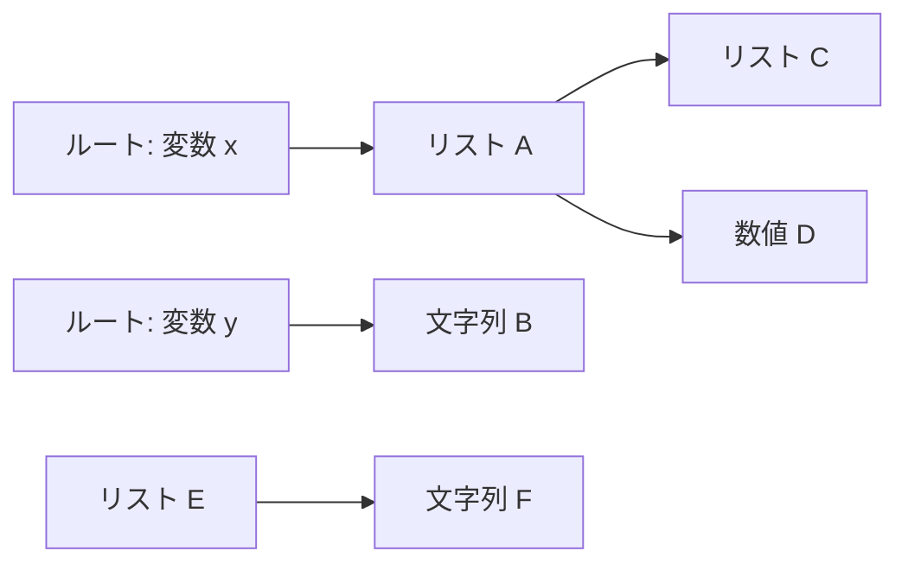
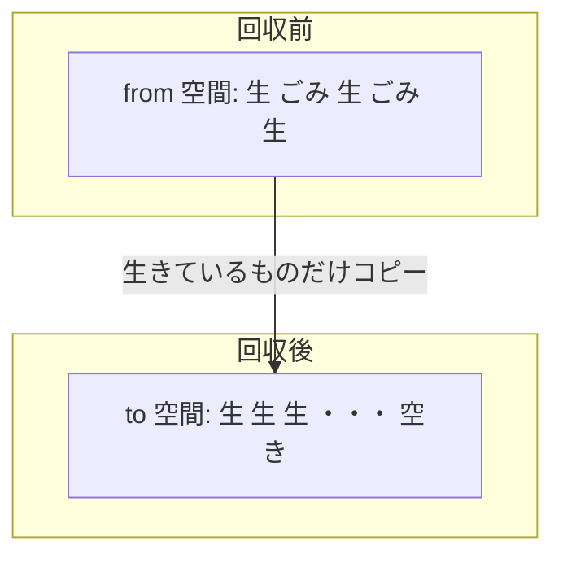

# 精密 GC とは何か

この章では、GC の世界を一通り見渡します。まず「なぜメモリを自動で管理したいのか」という動機から始め、GC の代表的な方式を紹介し、最後に本書の主役である**コピー方式の精密 GC** がその地図のどこに位置するのかをはっきりさせます。

## メモリと「ごみ」

プログラムが動くとき、データは**メモリ**という場所に置かれます。メモリは番地（アドレス）の付いた巨大なロッカーの列のようなもので、プログラムはそのロッカーを借りてデータを置き、使い終わったら返します。

データを置くためにメモリを借りることを**割り当て（allocation, アロケーション）**といいます。とくに、プログラムの実行中に必要なだけ自由に借りられる大きなメモリ領域を**ヒープ（heap）**と呼びます。文字列やリストのように「実行してみないと大きさや個数が分からないデータ」は、このヒープに割り当てられます。

問題は「返す」ほうです。借りたメモリを返さずに放置すると、ロッカーが埋まっていき、いつか新しいデータを置けなくなります。一方で、まだ使っているメモリを間違えて返してしまうと、データが壊れてプログラムが誤動作します。

ここで重要な言葉が**ごみ（garbage）**です。ごみとは、「これ以降プログラムが二度とアクセスしないデータ」のことです。たとえば、ある計算の途中で作った一時的なリストが、計算が終わったあとどこからも参照されなくなったら、それはごみです。ごみが占めているメモリは安全に再利用できます。

**ガベージコレクション（GC）**とは、このごみを自動的に見つけてメモリを回収し、再利用できるようにする仕組みのことです。GC という考え方は、最初のプログラミング言語の 1 つである LISP のために 1960 年に登場しました[](#cite:mccarthy1960)。半世紀以上にわたって研究され続けている、息の長いテーマです。

## 手動管理の何が大変なのか

GC のありがたみを理解するために、GC がない世界を覗いてみましょう。C 言語では、プログラマが自分でメモリを借り（`malloc`）、自分で返します（`free`）。

```c
char *buf = malloc(100);   /* 100 バイト借りる */
/* ... buf を使う ... */
free(buf);                 /* 使い終わったら返す */
```

一見単純ですが、現実には次のような失敗が頻発します。

- **解放し忘れ（メモリリーク）**：`free` を書き忘れると、そのメモリは永久に返されません。少しずつメモリが食い潰され、最後にはプログラムが落ちます。
- **二重解放**：同じメモリを 2 回 `free` すると、メモリ管理の内部状態が壊れます。
- **解放後の使用（use-after-free）**：`free` したメモリをまだ使おうとすると、すでに別のデータが入っているかもしれず、深刻なバグになります。

これらが厄介なのは、「いつ返すべきか」がプログラム全体の構造に依存するからです。あるデータを複数の場所から共有していると、「最後に使い終わるのは誰か」を人間が正確に追いきるのは非常に難しくなります。GC は、この「いつ返すか」という判断を機械に肩代わりさせる仕組みなのです。

> [!NOTE]
> 「ごみかどうか」を機械が判断する基準は、実は 1 つしかありません。**プログラムがこれからアクセスしうるか**です。これからアクセスしうるデータは生かし、アクセスしえないデータはごみとみなす。GC のあらゆる方式は、結局この判断をどう効率よく行うかの工夫だと言えます。

## 「生きている」とは何か：到達可能性

GC が生かすべきデータを「生きている（live）」、ごみを「死んでいる（dead）」と呼びます。では、機械はどうやって両者を区別するのでしょうか。

未来は予測できないので、「本当にこれからアクセスするか」を厳密に知ることはできません。そこで GC は、より安全側の近似を使います。それが**到達可能性（reachability）**です。

考え方はこうです。プログラムが「いま直接触れる」変数の集まりがあります。これを**ルート（root）**と呼びます。たとえば、いま実行中の関数のローカル変数や、グローバル変数がルートです。プログラムがあるデータにアクセスするには、ルートから出発して、ポインタをたどっていくしかありません。

**ポインタ（pointer）**とは、「別のデータがメモリのどこにあるか」を示す番地（アドレス）のことです。あるデータ A がポインタで別のデータ B を指しているとき、「A から B へ参照がある」と言います。

ここで、データの集まりを**グラフ**として捉えます。各データを点（ノード）、ポインタを矢印（エッジ）と見るのです。



ルートから矢印をたどって到達できるデータが**到達可能（reachable）**、すなわち生きているとみなされます。上の図では、`x` から A・C・D に、`y` から B に到達できます。一方 E と F はどのルートからもたどり着けません。E と F はごみです。

> [!IMPORTANT]
> 「到達可能なら生きている」というのは近似です。到達可能でもプログラムが二度と使わないデータはありえます（ただ参照が残っているだけ）。しかし「到達不能なら絶対に使えない」ことは確実です。GC はこの確実な側を使うことで、生きているデータを誤って捨てる事故を防いでいます。

## GC の代表的な方式

到達可能性をどう調べ、ごみをどう回収するか。そのやり方の違いが GC の「方式」です。代表的なものを順に見ていきましょう。これらを体系的に俯瞰した古典的なサーベイとして Wilson の解説[](#cite:wilson1992)があり、本節の整理もその枠組みに沿っています。

### 参照カウント

**参照カウント（reference counting）**は、各データに「いま自分を指しているポインタが何本あるか」という数（カウント）を持たせる方式です。ポインタが 1 本増えたらカウントを 1 増やし、減ったら 1 減らします。カウントが 0 になった瞬間、そのデータは誰からも指されていない＝ごみなので、すぐに回収します。

仕組みが直感的で、回収のタイミングが分散する（一気に止まらない）という長所があります。一方で、ポインタを書き換えるたびにカウント更新が必要でコストがかかること、そして**循環参照**を回収できないという弱点があります。A が B を指し、B が A を指していると、外から誰も使っていなくても互いのカウントが 1 のまま残り、ごみとして検出できないのです。

### マーク・アンド・スイープ

**マーク・アンド・スイープ（mark and sweep）**は、到達可能性をそのまま実装した方式です。2 つの段階からなります。

1. **マーク（mark, 印付け）**：ルートから出発してポインタを全部たどり、到達できたデータすべてに「生きている」という印を付けます。
2. **スイープ（sweep, 掃き出し）**：ヒープ全体を端から端まで走査し、印の付いていないデータをごみとして回収します。印は次回に備えて消します。

循環参照があっても、ルートから到達できなければきちんとごみと判定できます。これは参照カウントにない強みです。弱点は、回収したごみがヒープのあちこちに虫食い状に散らばること（**断片化**）です。空き領域が細切れになると、大きなデータを置く連続した空きが見つけにくくなります。

### コピー方式

**コピー方式（copying GC）**は、本書の主役です。ヒープを同じ大きさの 2 つの領域に分けます。一方だけを使い、もう一方は空けておきます。使っている側を **from 空間（from-space）**、空けている側を **to 空間（to-space）** と呼びます。

GC が起動すると、from 空間にある「生きているデータだけ」を to 空間へコピーします。コピーが終わったら、from 空間にはごみしか残っていないので、まるごと捨てて空にします。そして from と to の役割を入れ替え、次はいま書き込んだ側を使います。この入れ替えを**フリップ（flip）**と呼びます。



この方式には魅力的な性質があります。生きているデータを to 空間の先頭から詰めて並べるので、**断片化が起きません**。さらに、回収にかかる時間がヒープ全体の大きさではなく、おおむね「生きているデータの量」に比例します（厳密にはルート集合の走査などのコストも加わります）。ごみが多いほど割に合う、というわけです。この発想はもともと、巨大な仮想記憶上で LISP を動かすために考案されました[](#cite:fenichel1969)。

弱点は、ヒープを半分しか使えないこと（残り半分はコピー先として常に空けておく必要がある）と、生きているデータを物理的に動かすために**すべてのポインタを書き換えねばならない**ことです。この「ポインタを正確に書き換える」という要求こそが、次節の「精密」という話につながります。コピー方式の具体的なアルゴリズムは、第 5 章「コピー GC の仕組み」で詳しく扱います。

## 精密 GC と保守的 GC

コピー方式はデータを動かすので、データを指していたポインタを新しい番地に書き換えなければなりません。書き換えを正しく行うには、メモリ上の「この 8 バイトはポインタだ」「この 8 バイトはただの整数だ」を**正確に**区別できる必要があります。

この区別ができる GC を**精密 GC（precise GC、正確 GC とも訳されます）**と呼びます。精密 GC は、各データのどこにポインタが入っているかを完全に把握しているので、ポインタを安全に書き換えられます。これが、コピー方式のようにデータを動かす GC の前提です。もっとも、前提が揃っただけで完成するわけではありません。実際にデータを動かすには、ルートを漏れなく列挙し、すべての参照を確実に書き換える仕組みが必要です。その作り方が第 3 章・第 4 章の主題になります。

対する**保守的 GC（conservative GC）**は、この区別をあきらめます。メモリ上の値を見て「これはポインタの番地としてありえる範囲だから、ポインタかもしれない」と推測して扱うのです[](#cite:boehm1988)。区別のための情報を処理系に用意させなくてよいので、C のような「協力的でない」言語にも後付けできるのが長所です。なお、ルートだけを保守的に（推測で）扱い、それ以外の大半のオブジェクトは精密に動かす「ほぼコピー（mostly-copying）」という折衷的な方式も古くから知られています[](#cite:bartlett1988)。

しかし保守的 GC には原理的な制約があります。ある値が「本当はただの整数なのに、偶然ポインタに見える」場合、GC はそれをポインタとして扱わざるをえません。すると、その整数が指す「ことになっている」データを、念のため生かし続けてしまいます（**偽ポインタ**問題）。さらに致命的なのは、ポインタかどうか確信が持てない以上、その値を**書き換えられない**ことです。整数だったらうっかり書き換えると値が壊れてしまうからです。書き換えられないということは、保守的に（推測で）扱っている値が指すデータは**動かせない**ということです。つまり、本書で扱うような「すべての到達オブジェクトを動かす」単純なコピー方式は、保守的 GC では使えません。先ほど触れた mostly-copying は、まさにこの制約への折衷です ── 曖昧なルートから直接指されたオブジェクトだけは動かさず、残りを精密に動かすのです。

> [!WARNING]
> 「保守的」という言葉は「安全側に倒す」という意味で、品質が劣るという意味ではありません。実際、保守的 GC は広く使われている実用技術です[](#cite:boehm1988)。ただし本書の目的（コピー方式でデータを動かす）のためには、ポインタを正確に把握できる精密 GC が必須になります。

両者の違いを整理すると次の表のようになります。

| | 精密 GC | 保守的 GC |
|---|---|---|
| ポインタの識別 | 正確に分かる | 推測する |
| データを動かせるか | 動かせる | 動かせない |
| コピー方式 | 使える | 使えない |
| コンパクション | 使える | 使えない |
| 処理系への要求 | 大きい（型情報が必要） | 小さい（後付け可能） |
| 偽ポインタの心配 | ない | ある |

なお、この表は「すべてを精密に扱う GC」と「すべてを保守的に扱う GC」を対比したものです。実処理系には、ヒープ上のオブジェクトは精密に扱い、C のスタックだけを保守的に走査する、といった**折衷（ハイブリッド）**もあります。その場合、偽ポインタの心配や「動かせない」制約は、保守的に扱う部分にだけ残ります（第 6 章で再登場します）。

本書はインタプリタを「最初から精密 GC 向けに設計する」立場をとります。インタプリタは自分が作るデータの形を全部知っているので、ポインタの位置を正確に管理するのに好都合なのです。その具体的な作り方は、第 3 章・第 4 章で扱います。

## まとめ

- プログラムは**ヒープ**にデータを割り当てて使い、使わなくなったデータは**ごみ**になる。
- GC はごみを自動回収する仕組みで、判定の基準は**ルートからの到達可能性**である。
- 代表的な方式に**参照カウント**、**マーク・アンド・スイープ**、**コピー方式**がある。
- コピー方式は断片化がなく、生きているデータ量に比例した速さで回収できるが、データを動かすため**精密 GC** が前提になる。
- **精密 GC** はポインタを正確に識別でき、**保守的 GC** は推測で扱う。コピー方式やコンパクションが使えるのは精密 GC だけである。

次章では、その GC を載せる「現場」であるインタプリタの仕組みを見ていきます。
